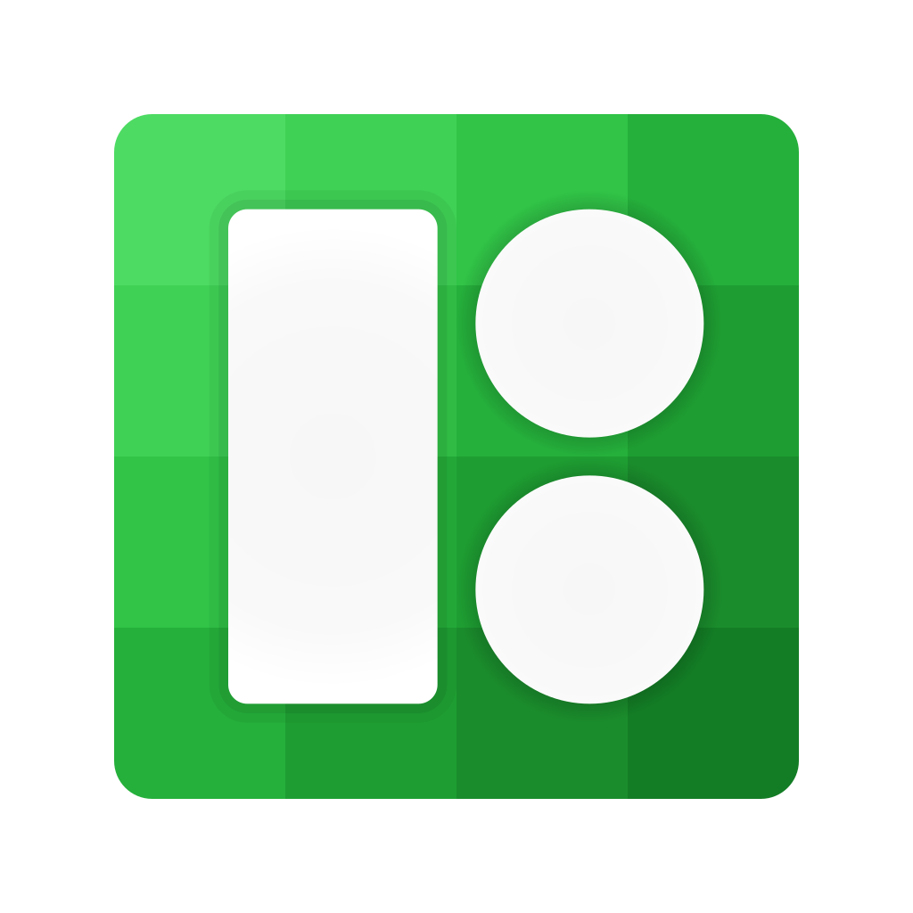

# License (Must read)

    

Icons used in this project are either:
* Made by me
* Stock
* Provided by Microsoft
* Provided by [Icon8](https://icons8.com/)

## Made by Icon8

Icons made by Icon8 were provided through Icon8's generosity towards open-source projects. Icons were obtained through their paid plan. **You are not allowed to use those icons outside of this project. It is prohibited to resell or redistribute them.**

    

If you want to contribute and use an icon that's not in the project already, you'll need to purchase a license and import it yourself.

Some icons were downloaded ahead of time because I knew I would need them in a future update (approved by Icon8's support). To be fair, I only had one chat with the support and had to interpret some legal details myself. If there were any misunderstandings or terms I broke, please let me know. If anyone from Icon8's team is reading this, feel free to email me at tomkliner9@gmail.com. *Chat logs are available for inspection: `Support Chat.txt`*

I strongly recommend using Icon8 for your open-source project, especially if you're making a Windows app. The communication with them has been smooth, and they provide clear answers.
